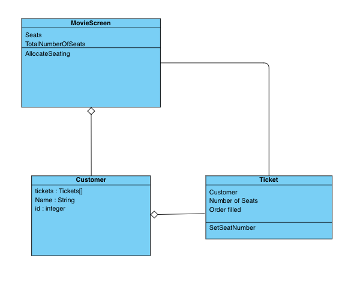

#### README.md

### Movie Theatre Seating Challenge

#### Introduction
The task is to develop a program to allocate seats to customers purchasing tickets for a movie theatre. Well-designed and tested code representing real-world scenariosEvidence of Test-Driven Development being applied
clear communication and documentation.

#### Implementation
There are three classes :
- MovieScreen class, which deals with the seating.
- Ticket class, the Customer allocation of between 1-3 seats, with the seat numbers.
- Customer class. Contains record of all ticket allocations.

A client can allocate tickets until the theatre is full. In this scenario there are 15 seats. In the test code function CheckFillingUpAllSeatingInAllocateSeating, the seating is filled up with random orders (generating a ticket) of between 1-3 seat.

This test code function, CheckFillingUpAllSeatingInAllocateSeating, provides an example of how to use the code.

#### Issues.
1. If the input is greater or lesser than the allowed the function AllocateSeating will throw an exception. Also if there are not enough seats to complete and order. The API is using exceptions as part of the contract with the user.
2. The AllocateSeating function is basic. In future Customer may want to choose seats. Or seats are (automatically) ket together when possible.
3. There may be more than one screen in the Cinema. Each with own seating configuration. This design is simple but should be easy to upgrade.
4. This can be the core of a ticketing system. The returned ticket being the basis of a Customer order.